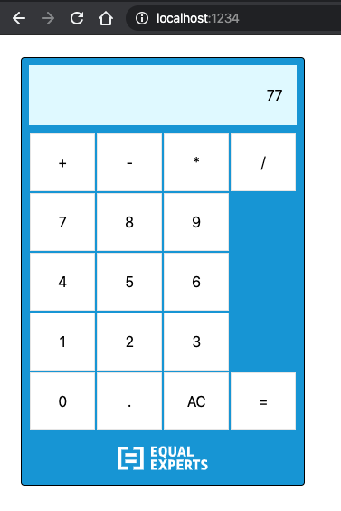

# Simple Calculator

A simple calculator written in JavaScript and tested using Jest.

## Prerequisites

Ensure that a recent version of Node.js is installed and active. After cloning this repository, run `npm install` to ensure that dependencies are installed and up to date.

## Running the calculator

To run the calculator, from your terminal run the following command (from the root directory of this project);

```bash
npm start
```

You should navigate your browser to `http://localhost:1234` to see the application running.



## Run the tests

To run the tests, from your terminal run the following command (from the root directory of this project);

```bash
npm test
```

To see code coverage, run;

```bash
npm test -- --coverage
```


## Other

Instructions for tech interview test version number `e5ce2b40e077ee165c0a6b7598317089354c8922`.

## A bit of reasoning

- I used vanilla JavaScript for the bulk of the code, because using a framework like React seemed bulky and unnecessary. All the functions/methods/language syntax used throughout has excellent browser support.
- I used Jest as the unit test runner because it is very simple and easy to set up
- I used Parcel.js as the development server/module bundler/loader because it is fast, requires no config, and has hot module reloading (faster development)
- I didn't use any particular patterns and techniques for the JavaScript or CSS because, frankly, there was no need to. This would change if the application became more sophisticated.
